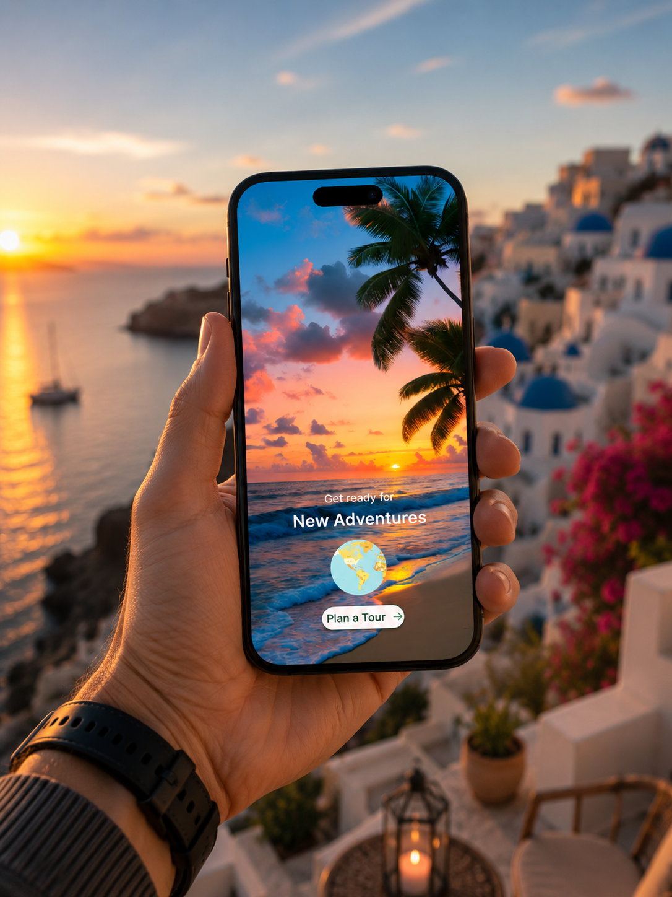
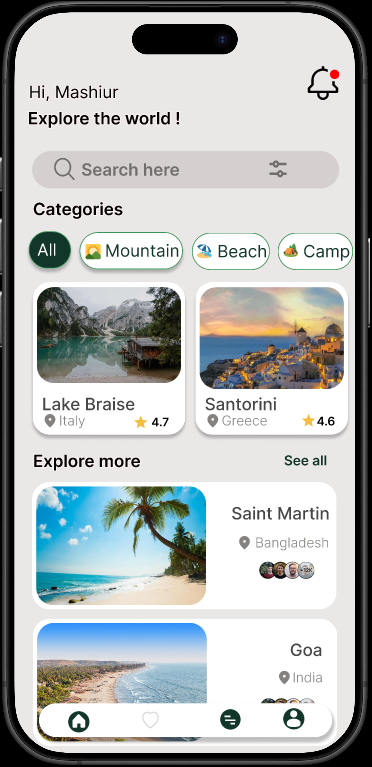
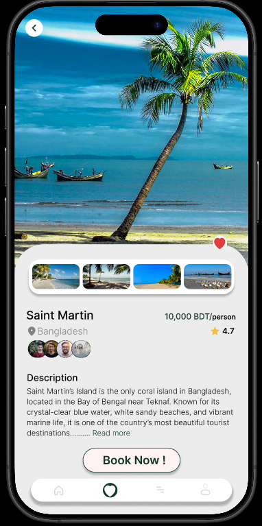
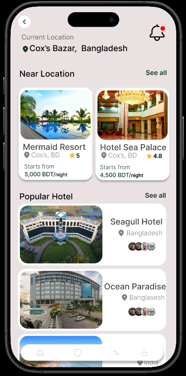
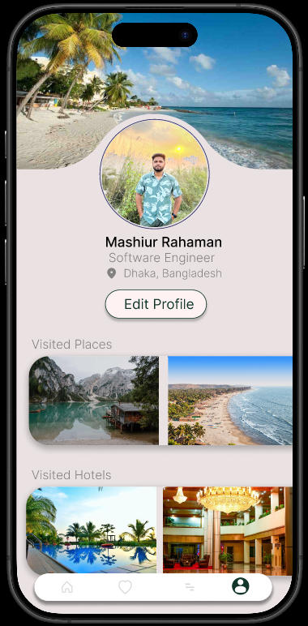
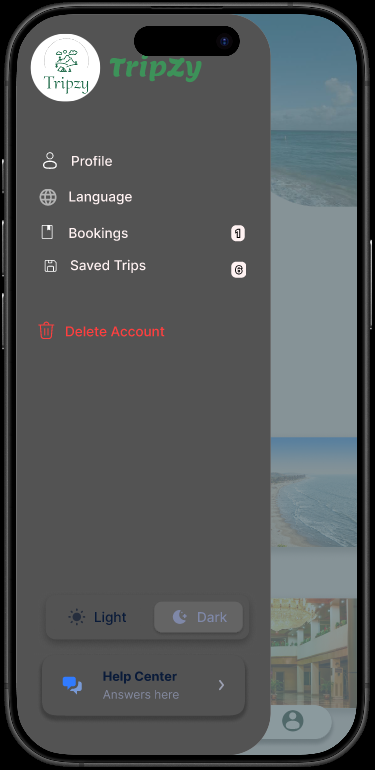

# Tour Management UI/UX Design

A complete UI/UX design prototype created in **Figma** for an academic assignment, focused on usability, accessibility, and modern interface consistency.

---

## Figma Design Link

[Live Link Here](https://www.figma.com/design/ygyRMJ7BHMRlvLsVEhco2s/428-Assignment?t=BSVbUoWsHNP3XvHY-1)

---

## Project Overview

This project demonstrates a full design workflow including:

* Requirement analysis
* User flow planning
* Wireframing
* High-fidelity UI design
* Interactive prototyping

The goal was to create a modern and user-friendly digital experience while maintaining strong design consistency and accessibility standards.

---

## Tools Used

* Figma
* UI/UX Design Principles
* Wireframing
* Prototyping
* User Flow Mapping
* Design Systems

---

## Features

* User-centered interface design
* Interactive clickable prototype
* Consistent visual hierarchy
* Responsive layout planning
* Accessibility-focused spacing and typography
* Reusable component system
* Structured navigation flow

---

## Challenges

* Balancing aesthetics and usability
* Maintaining consistency across multiple screens
* Designing responsive layouts
* Creating intuitive navigation patterns

---

## Learnings

* Improved Figma prototyping skills
* Better understanding of UI/UX principles
* Enhanced wireframing and user flow planning
* Learned scalable design system creation
* Strengthened accessibility-focused design decisions

---

## Preview

### Splash Screen

### Home Screen

### Destination Overview

### Hotel Options & Overview

### Profile View

### Theme Change (Dark/Light)

---

## Author

**Mashiur Rahaman Mollah Niran**

Software Engineering Student

East West University
